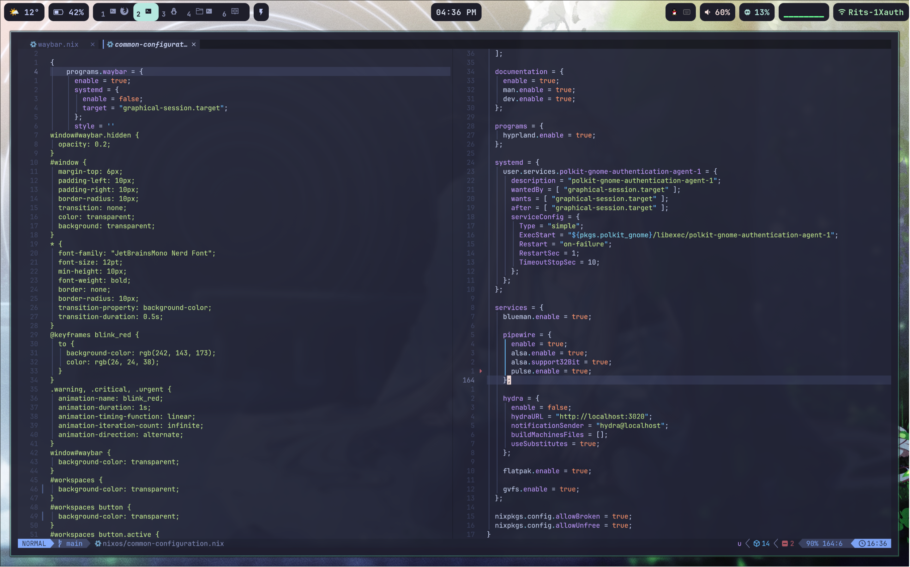

## KUD's nixos config

forked from Misterio77's [starter](https://github.com/Misterio77/nix-starter-configs), copied a lot from HeinzDev's [config](https://github.com/HeinzDev/Hyprland-dotfiles) and pimeys's [config](https://github.com/pimeys/nixos)

| Category      | Software  |
| -------------- | --------- |
| Window Manager | Hyprland  |
| Launcher       | Rofi      |
| System Tray    | Waybar    |
| Browser        | Firefox   |
| Input Method   | Fcitx5    |
| Editor         | nvim      |

now working on two setups:
- Desktop(Lain): 13600K+6600XT+ASUS B660i
- Laptop(Mikan): 7840HS XiaoXin 14 Pro (2023)

some special thing:
- customize for XiaoXin 14 Pro (2023)
  - including script that call acpi

- modified keyboard layout a lot
  - use jp layout on us keyboard

## TODOs
- [ ] how to upload newly built binarys to cachix when doing nixos-rebuild
